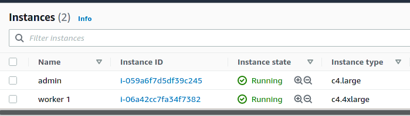

# Extended Performance Testing

The way we achieved extending performance testing was to use actual network infrastructure rather than mininet. To that end, AWS infrastructure was utilized. We spun up three instances (two of which were still up for the screenshot below). These instances ran the middleware natively as demonstrated by the figure below.



There the `admin` server was responsible for running the `broker` as well as either the `publisher` systems. The `worker 1` and `worker 2` (not shown) instances were responsible for subscribing a large number of processes and threads to the `publisher` (or `broker` in proxy mode).

The mechanism by which we achieved maximum performance (with Python) was to use the `multiprocessing` library so we could utilize all available CPU cores, and for each core spin up a number of threads commensurate with the test case. The skeleton code for this can be seen below.

```
from multiprocessing import Manager, Process, cpu_count
from threading import Thread
from time import sleep
from random import randint

def t_job():
    print("started t_job")
    sleep(randint(1,2))
    
def thread(n):
    threads = []
    for i in range(8):
        t = Thread(target=t_job)
        threads.append(t)
        t.start()    
        
        for i in threads:
            i.join()
            print(f"Done with threads...{i}")

def process():
    processes = []
    with Manager() as manager:
        for i in range(cpu_count()):
            proc = Process(target=thread, args=(8,))
            processes.append(proc)
            proc.start()
            print(f"Started process {i}")        
            
        for p in processes:
            p.join()
            print("joined process...")
            
process()
```

For the maximum usage (512 subscribers) we had the following two systems:


CPUs: 16 (1 process per core)  
Threads: 16 (per process)  
Total: 256 subscribers  

There were 2 computers performing the above.


