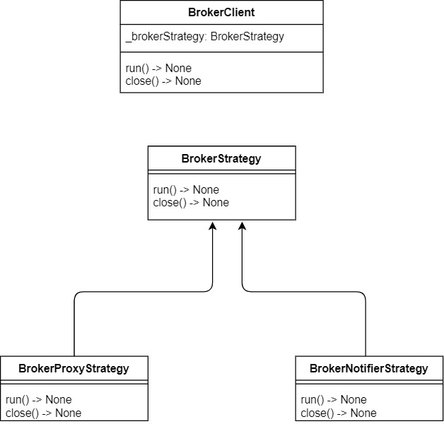
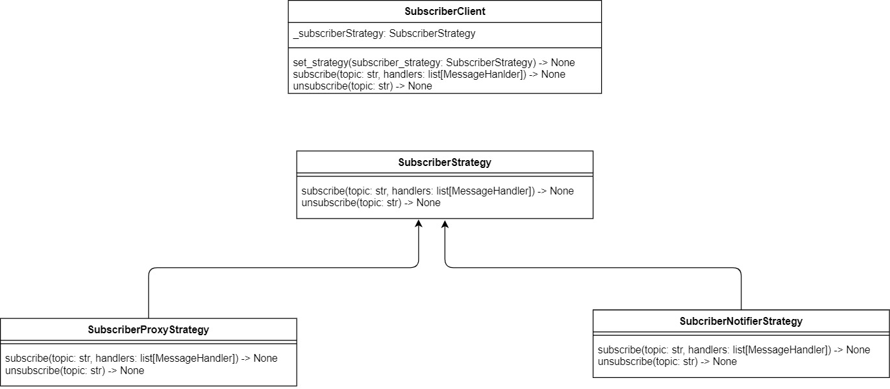
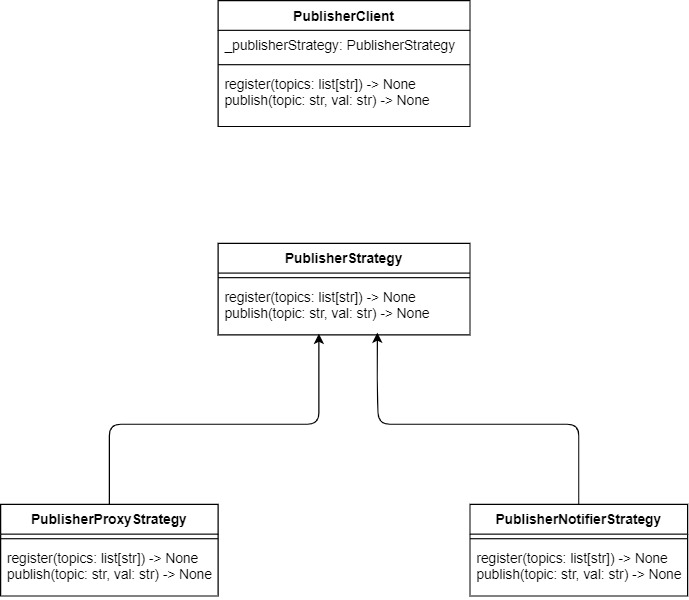

# CS6381_Project
###### Authors: Cory &amp; Sam's CS6381 Project
</br>

## Documentation

This repository contains middleware built on top of 0MQ's pyzmq library. The middleware's aim is to provide a unified API for two different types of brokers in a pub/sub architecture.

### Terms and Definitions

##### Message
These are considered the 'payload' for communication between Publishers and Subscribers, in the real world, these can either be bytes, strings, or strings that contain json objects that are later deserialized into in-memory objects.

##### Topic
Strings that are assigned to each message that tells the Publisher or Subscriber what type of message it is. For Publishers, they are important in order to let the middleware know what types of messages they publish. For Subscribers, these are important to notify the middleware which messages they should receive.

##### Subscriber 
These are the receivers in the pub/sub architecture, they receive messages from Publishers directly or indirectly from a broker. Subscribers will only receive messages directly from publishers if you choose to run the middleware in the Notifier Mode, otherwise, Subscribers will receive messages from the broker in Proxy Mode.

##### Publisher 
These are the entities that send messages in the publisher/subscriber architecture, in our middleware they send messages either directly or indirectly to Subscribers, depending on if you are using Notifier Mode or Proxy Mode, respectively.  

##### Broker
This middleware has two implementations of a broker, a broker that can run in Notifier Mode and a broker that can run in Proxy Mode, we will explain the differences later in this document but for now know that the broker in either mode assists in routing published messages from Publishers to Subscribers that are subscribed to those topics.

##### Client
This is just a term for any application code that either utilizes the Publisher or Subscriber middleware of this project. The application code will handle the sending and receiving of messages through an abstraction (see 'Implementation Details' for info) without necessarily having to know about which implementation of the broker is being used.

##### Mode 
Refers to the which implementation, Proxy or Notifier, is being used. There is a command line argument, --flag, that determines this (see 'API & Usages' section).

##### Notifier Mode
This implementation is used when --flag=notifier is passed in via the command line argument. This implementation allows Publishers to directly communicate to Subscribers via a broker, where the broker notifies Subscribers which Publishers to connect to to receive messages.

##### Proxy Mode
This implementation is used when --flag=proxy is passed in via the command line argument. This implementation allows for Publishers to publish messages without knowing about which Subscribers are subscribed to those messages and vice versa with Subscribers. When a Publisher publishes a message, it will relay it through a proxy (see 'Implementation Details' for more info) which knows and determines which subscriber to send the message to. 

#### API & Usages
We'll now go over how to interact with this sytem. The middleware is designed to be used by three different types of programs: 
* A broker program that shouldnt need any application code beside what is provided by our middleware
* A subscriber program that can have additional application code besides what our middleware provides
* A publisher program that can also have additional application code besides what our middleware provides

##### Creating Clients (note these may change due to todo # 10)
The client is the main class in our API that you can interact with. In our examples we have some other helper classes that take care of this setup to reduce the amount of code, but they are not required.

The middleware can be thought of being broken up into 2 different implementations, which dictates how the system's participants will interact with each other and must be used together in order for the system to work as intended:
* Notifier: BrokerNotifierStrategy, SubscriberNotifierStrategy, & PublisherNotifierStrategy -  this facilitates communication between subscribers and publishers directly.
* Proxy: BrokerProxyStrategy, SubscriberProxyStrategy, & PublisherProxyStrategy -  this facilitate communication between subscribers and publishers be decoupled, where messages are routed purely through a broker

The implementation is dependent on if you use the 'flag=notifier' or 'flag=proxy' command line argument.

###### BrokerClient
To create a broker client, all that is needed is to instantiate either a BrokerNotifierStrategy or a BrokerProxyStrategy and pass it into the BrokerClient
```
# creating a BrokerClient that behaves under Proxy Mode
# the first argument passed into the proxy strategy is the port in which the broker will attach to
# the second argument dictates what port the XSUB socket will attach to
# and the third argument dictates what port the XPUB socket will attach to
proxyStrat = new BrokerProxyStrategy("127.0.0.1", "5560", "5561", DateTimeConsoleLogger())
proxyClient = BrokerClient(proxyStrat)
```

```
# creating a BrokerClient that behaves under Notifier Mode
# the first and second argument will dictate which address and port the REP socket will attach to
notifierStrat = new BrokerNotifierStrategy("127.0.0.1", "5560", DateTimeConsoleLogger())
notifierClient = new BrokerClient(notifierStrat)
```

###### PublisherClient
To create a publisher client, all that is needed is to instantiate either a PublisherNotifierStrategy or a PublisherProxyStrategy and pass it into the PublisherClient
```
# creating a PublisherClient that behaves under Proxy Mode
# The BrokerInfo passed in here is used in order to connect to the broker
proxyStrat = new PublisherProxyStrategy(BrokerInfo("127.0.0.1", "5560"), DateTimeConsoleLogger())
client = Publisherclient(proxyStrat)
```

```
# creating a PublisherClient that behaves under Notifier Mode
# the publisher uses the BrokerInfo passed in here to connect to the broker.
# It uses the PublisherInfo in order to determine what port it will publish on and when a new publisher is registered, it will consume one of the ports (may change due to todo # 12)
notifierStrat = new PublisherNotifierStrategy(BrokerInfo("127.0.0.1", "5560"), PublisherInfo("127.0.0.1", ["5000","5001","5002"]))
client = Publisherclient(notifierStrat)
```

###### SubscriberClient
```
# creating a SubscriberClient that behaves under Proxy Mode
# The subscribers will use the BrokerInfo to connect to the broker. The list of topic handlers here are unused and will be removed in the future.
proxyStrat = new SubscriberProxyStrategy(BrokerInfo("127.0.0.1", "5560"), "5559", [TopicHandler("SPORTS", [SportsMessageHandler()]]), DateTimeConsoleLogger())
client = SubscriberClient(proxyStrat)
```

```
# creating a SubscriberClient that behaves under Notifier Mode
# uses BrokerInfo to connect to the broker and takes in a list of topic handlers that are unused at the moment and will be removed from the constructor parameters
notifierStrat = new SubscriberNotifierStrategy(BrokerInfo("127.0.0.1", "5560"), DateTimeConsoleLogger(), [])
```

For the examples we provide, its important to note that we are using a few helper classes in order to setup our middleware a little easier, but these can be defined by the application code developers and are not required:
* App - this program is responsible for parsing the value of the command line arguments. It looks only for the --flag command line argument which dictates what mode we should run the Broker, Publisher, Or Subscriber middleware in.
* BrokerApp - inherits off of App, this class is responsible for creating the BrokerStrategy object, which will dictate what behaviour the Broker will exhibit
* PublisherApp - inherits off of App, this class is responsible for creating the PublisherStrategy object, which will dictate what behaviour the Publishers exhibit
* SubscriberApp - inherits off of App, this class is responsible for creating the SubscriberStrategy object, which will dictate what behaviour the Subscribers exhibit

Examples can be found in merged/examples

#### Implementation Details
We'll now go over how everything works underneath the hood. 

We will go over each part of the system. The main pattern we use in our middleware is the strategy pattern which you can read more [here](https://refactoring.guru/design-patterns/strategy/python/example)

###### Broker Patterns
</br></br>

</br></br>

###### BrokerClient
This is a lightweight class that acts as the consumer of the BrokerStrategy abstract class, its main purpose is to delegate calls to run() & close() to a reference of BrokerStrategy, _brokerStrategy. As you can see, the BrokerClient is unaware of which BrokerStrategy implementation we use, it simply uses whichever Strategy that is passed in at runtime.

###### BrokerStrategy
This is an abstraction that allows the BrokerClient to be unaware of how the Publishers & Subscribers communicate with each other. It defines the following methods:

* run() - used by each implementation to setup what is needed, for our implementations it sets up the appropiate sockets that it will use to communicate with the Subscribers & Publishers
* close() - used by each implementation to teardown any resources that they need to free up - 0MQ documentation recommends that when you stop an application that you close each socket, otherwise some undefined behaviour may occur.
 
###### BrokerProxyStrategy
When this implementation is instantiated, we setup XPUB & XSUB sockets and setup a zmq.Proxy object, this object is what does the heavy lifting when Subsribers subscribe to topics and when Publishers publish to those topics. There isnt much to it then that, luckily for us 0MQ's proxy object does all of the heavy lifting for us here. Below are descriptions of its methods:
* run() - starts up the zmq.proxy, which also starts to listen for any published messages
* close() - closes the XPUB & XSUB sockets and closes the 0MQ context

###### BrokerNotifierStrategy
When this implemenation is instantiated, we setup a REP socket that handles two types of requests from either a Publisher or Subscriber
* 'request\${topic}' - when the BrokerNotifierStrategy receives a REQ message with a payload starting with 'request$', which should be from a Subscriber, it parses the topic out of the payload and then returns all publishers of that topic. This allows any Subscribers using our middleware to Subscribe to a topic at any time and receive the most up to date Publishers that are publishing those topics. The subscriber can then connect to those publishers.
* 'register\${json}' - When the BrokerNotifierStrategy receives a REQ message with a payload starting with 'register$', which should be from a Publisher, it parses the json out of the payload and then uses the object it parsed to register and store the information in a list for later retreival when a Subscriber asks for Publishers that are available. The object is in the form 
	```
	{
		ip: str
		port: str
		topics: list[st]
	}
	```

###### Subscriber Patterns
</br></br>

</br></br>

###### Subscriber Client
This is also a lightweight class that acts as the consumer of the SubscriberStrategy abstract class, it delegates calls to subscribe() and unsubscribe() to a SubscriberStrategy reference , _subscriberStrategy. Like the BrokerClient - this class in unaware of which SubscriberStrategy implementation is being used.

###### SubscriberStrategy
This is the abstraction that allows the SubscriberClient to be unaware of how the Subscribers subscribe to topics. It defines the following methods:
* subscribe(topic: str, handlers: list[MessageHandler]) - used by each implementation to setup the appropiate sockets in order to receive published messages. Also takes in a list of MessageHandlers which can be thought of as callback functions that occur when a message of the specified topic is received. Multiple handlers can handle one topic
* unsubscribe(topic:str) - used by each implementation to unsubscribe to a specified topic.
* listen() - used by each implementation to start the listening of each subscriber for published messages
* close() - used by each implementatino to close down any sockets or 0MQ contexts

###### SubscriberProxyStrategy
This implementation's methods do the following:
* subscribe(topic: str, handlers: list[MessageHandler]) - Creates a ProxySubscriber object which is a helper class that holds a reference to a 0MQ SUB socket and the topic being subscribed to. It then connects to this socket and adds the ProxySubscriber to a list of Subscribers so when we can call listen(), we will know which subscribers we need to listen for
* unsubscribe(topic: str) - goes through the list of ProxySubscribers we keep track of and removes the subscribers that have the matching topic from the list and closes the socket (todo #2)
* listen() - Goes through the list of ProxySubscribers and listens on their sockets for any messages (todo #7) asynchronously.
* close() - simply goes through the list of ProxySubscribers and closes their sockets to free them up

###### SubscriberNotifierStrategy
(todo #5) When this implementation is created, it creates a REQ socket so we can later make requests to the NotifierBroker, the methods do the following:
* subscribe(topic: str, handlers: list[MessageHandler]) - Makes a request through the REQ socket with a string starting with 'request' (which to recap, causes the BrokerNotifierStrategy to receive that request and return all Publishers of that topic). For each publisher received, it creates a helper class, NotifierSubscriber, which connects to the publishers using what it received from the BrokerNotifierStrategy, then adds it to a list of NotifierSubscribers so we can use them to listen for messages.
* unsubscribe(topic: str) - Goes through the list of NotifierSubscribers and removes and closes any NotifierSubscribers that have a matching topic of the pass in topic parameter. (todo #6)
* listen() - Goes through the list of NotifierSubscribers and asynchronously listens for messages for each one.
* close() - Goes through the list of NotifierSubscribers and closes their sockets.

###### MessageHandlers
This is a pretty simple abstract class that allows developers to define how they want each topic to be handled. Its meant to be nothing fancy and can be thought of as a callback function that receives message payloads. In the future if we wanted to, it'll allow for more complex behavior such as serialization/deserialization, or to combine the use of other event driven patterns such as CQRS. 


###### Subscriber Patterns
</br></br>

</br></br>

###### PublisherClient
This, like the other client classes, is a leightweight class that acts as the consumer of the abstract class, PublisherStrategy. It delegates calls to register() & publish() to a PublisherStrategy reference, _publisherStrategy. Like the others, this class is unaware of which PublisherStrategy implementation is being used.

###### PublisherStrategy
This is the abstraction that allows the PublisherClient to be unaware of how Publishers publish each topic. It defines the following methods:
* register(topic: list[str]) - Used by our implementations to alert the broker of the Publisher's existence
* publish(topic: str, val: str) - Used by our implementations to publish messages to the specified topic

###### PublisherProxyStrategy
This implementation's methods do the following:
* register(topic: list[str]) - Creates a helper class object, ProxyPublisher, which contains a reference to a 0MQ PUB socket. It then connects to this socket and adds it to a list of publishes it maintains a reference to
* publish(topic: str, val: str) - For each Publisher in the list of Publishers it keeps a reference to, it will publish the val string as a message to any Publishers that have a topic of the one specified

###### PublisherNotifierStrategy
When this implementation is instantiated, it will create a REQ socket and maintain a reference for later use (todo #9), the implementation's methods do the following:
* register(topic: list[str]) - First it grabs a port off of the port pool that is provided to the strategy. It then creates a helper class object, NotifierPublisher, which containes a reference to a 0MQ PUB socket. It then binds to this socket using a port off of the port pool and adds it to a list of Publishers that it maintains a reference to. After this, it will notify the broker of the Publisher's existence by sending request using the REQ socket it created (todo #9) and sending a string containing a json object with the Publisher's information (remember the broker will receive this request and add it to the list of Publishers it maintains). The json object takes the form of:
	```
	{
		ip: str,
		port: str,
		topics: list[str]
	}
	
* publish(topic: str, val: str) - For each publisher in the list of publisher it keeps a reference to, it will publish the val string as a message to any Publishers that have a topic of the one specified.
###### Logger
This is an abstract class that we use to help us log various information (publishing, subscribing, registering) and may not be in the final product
todo:
3. SubscriberProxyStrategy, line 11: looks like we can get rid of the topic_handlers constructor parameter. I think this was used on one point but i moved it to the Client code
4. SubscriberNotifierStrategy, line 17: looks like we can remove self.__topic_handlers as it looks unused
5. SubscriberNotifierStrategy creates a socket for each call to get_available_publishers_by_topic, we probably need to only set this up once.
7. SubscriberProxyStrategy - we can probaby copy what SubscriberNotifierStrategy is doing and not wait for each message each subscriber is waiting for.
8. Higher level issue - in notifier mode, when a publisher signs on, subscribers do not know about new publishers. We can make the notifier mode slower (which may be good for our assignment to show the issues with this approach) by forcing each subscriber to go and ask the broker for the Publishers that publish those topics and connect to the ones that the subscriber doenst know about (which would be any new publishers that have signed on after the subscriber subscribes to a specifieid topic).
9. PublisherNotifierStrategy, we probably need to make the REQ socket once in the constructor
10. Standardize whether or not we pass in an object to the strategy objects or strings. its a little messy the way its setup now since the ctor parameters look different for each strategy
11. Do we need to remove Logger? i mostly use this for devleopment but could see it as a benefit to application developers using this middleware
12. the port pool is not needed, we can probably remove it if we dont want to allow application code to register more than one publisher (one publisher = one socket)
