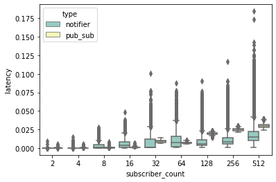
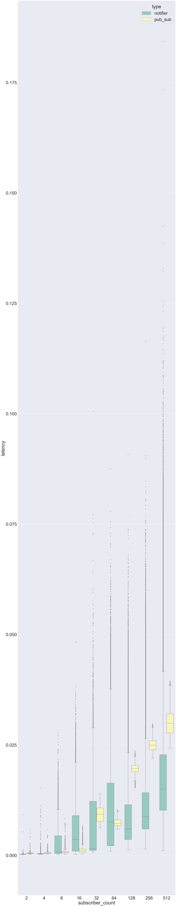
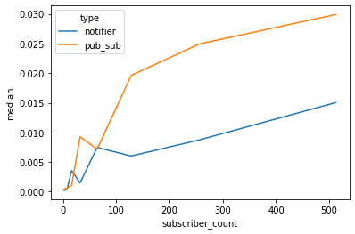
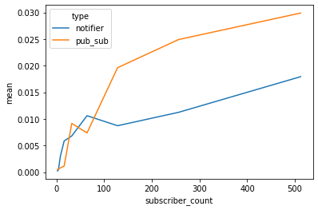
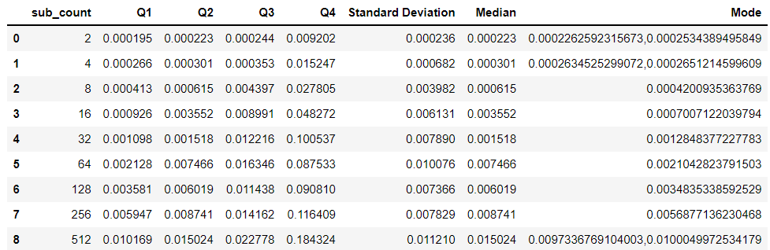
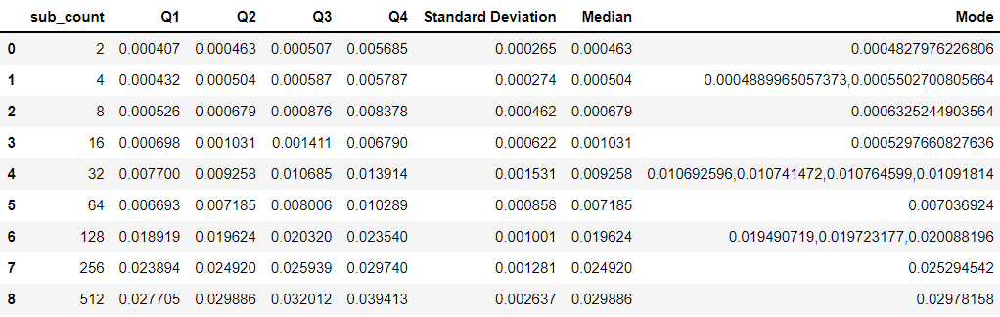

# Data Analysis & Charts

## Graphs
###### The following is a version of our box plot

###### The following is a vertically stretched boxplot to make it a little easier to read, do note: due to the range of the data, we could not easily fit it on the graph

###### The following is a plot of median versus the latency

###### The following is a plot of mean versus the latency

## Statistics
##### Notifier

##### Pub/Sub

 
#### Data Analysis
We observed that 0MQ looks to optimize itself when the subscriber count reaches about 100, after which it quickly stabilizes linearly, up to our max subscribers. Therefore we found that as the number of unscribers increase, the more predictible the system behaves. As far as the boxplot goes, we did observe the range of Q1 and Q3 does not predictibly get bigger. However, we did observe more outliers as the subscriber count increased. Surprisingly, notifier mode was quicker, but again both had a lineary rate of change with respect to the number of subscribers.The graphs shows that while the notifier is more performant than the proxy-broker, they both stabilize and increase at the same linear rate. This suggests that there is some constant factor of processing overhead when proxying results, which would account for the performance delta. We also peeked into the latency measurements for the 512 subscriber count, and we found that the first messages that are published actually have a latency less than that of the rest of the messages, we found that they typically converge to around .35. We believe that the garbage collector of python may be affecting the performance as we receive more and more messages.

